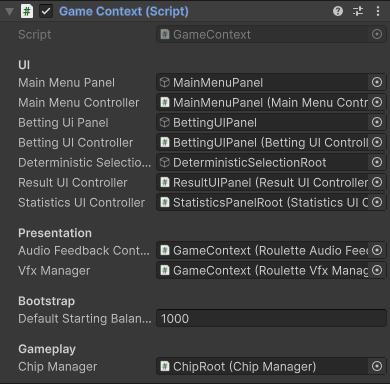
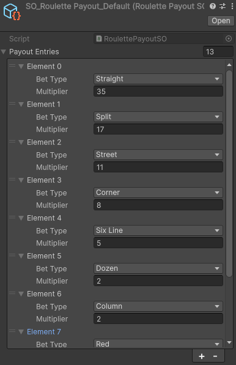

# RouletteGame (Deterministic Roulette Prototype)

A 3D single-player Deterministic Roulette prototype built with Unity 6000 and C#

## 🎮 Controls & Gameplay Instructions

1. **Main Menu**: Start the game and choose your table mode. 
2. **Betting Phase**: 
   - Drag 3D chips from the bottom tray directly onto the roulette table betting spots.
   - Hover over spots to see a visual highlight of the covered numbers.
   - **Right-click** on any placed chip on the board to return it to the tray.
3. **Deterministic Outcome Selection**:
   - Open the deterministic number panel via the UI.
   - Click to force the next winning number, or leave it as Random.
4. **Spinning Phase**:
   - Press the **Spin** button to lock in your bets and start the round.
   - The wheel and ball animate deterministically toward your selected (or random) result.
5. **Resolution**:
   - Payouts are calculated automatically. Winning chips are highlighted and paid out.
   - Player statistics and balance are updated, and the next betting round begins.

## ✨ Implemented Case Features

- **Deterministic Outcome Selection**: Fully integrated UI numpad for choosing the exact outcome of the spin.
- **Realistic Wheel & Animations**: A 3D roulette wheel that uses continuous deterministic math (no Unity Physics rigidbodies) to smoothly drop the ball onto the exact chosen pocket.
- **Full Roulette Rules**: 
  - **Inside Bets**: Straight, Split, Street, Corner, Six Line.
  - **Outside Bets**: Red/Black, Even/Odd, High/Low, Dozens, Columns.
  - Accurate Payout calculation table via ScriptableObjects (`RoulettePayoutSO`).
- **Player Statistics Tracking**: Tracks total spins, total wins, total wagered, total won, and net balance/profit.
- **Save & Load (Auto-Save)**: Uses persistent JSON serialization to save the player's balance, statistics, and even their current active table bets automatically. It resumes the exact state upon reopening.
- **Polished Presentation**: Audio feedback for chip placements and spins, with a robust VFX manager ready to coordinate visual highlights and celebrations.

## 🏗️ Design Patterns Used

The project architecture strictly adheres to OOP and SOLID principles to ensure maintainability and modularity:

- **State Pattern**: The core game flow is driven by a standalone `StateMachine`. Phases are broken down into `InitializeState`, `BettingState`, `SpinningState`, and `ResultState`. This isolates phase-specific logic (e.g., locking bets while spinning).
- **Observer / Event Pattern**: UI controllers, wheel rotation events, and betting totals rely on C# events (`Action`) to decouple systems. The UI reacts to data changes rather than polling.
- **Singleton / Static Utility**: `SaveLoadManager` acts as a static utility for JSON disk persistence, avoiding unnecessary MonoBehaviour singletons for pure data logic.
- **Composition Root / Controller Pattern**: `GameContext` acts as the central composition root for the scene. It holds references to all sub-managers (like `BetManager`, `WheelController`, `ChipManager`) without embedding their logic, routing dependencies to the State Machine.
- **Model-View Separation**: `PlayerData` stores pure data, while components like `StatisticsUIController` only read and present it.

## 🖼️ Editor Setup & Configuration

To demonstrate the clean and data-driven architecture of this project, here are some key configurations from the Unity Editor:

### 1. GameContext (Composition Root)
*This screenshot shows how all scene dependencies and UI controllers are injected into a single central context, keeping the rest of the game logic decoupled.*



### 2. RoulettePayoutSO (Scriptable Object)
*This screenshot demonstrates the data-driven approach for configuring bet types, multipliers, and default chip values outside of code.*



## 🚧 Known Issues & Future Improvements

- **American Roulette (Double Zero)**: The architecture fully supports an American mode layout and profiles. However, the visual 3D table assets and wheel currently only reflect the European layout. Full visual integration for double-zero is a planned future improvement.
- **Celebratory VFX**: While the `RouletteVfxManager` framework is in place to play win sequences and settlement particles, the final dazzling visual effect assets (like confetti/sparkles) are not fully tuned yet.
- **Automated Tests**: Unit tests could be added to formally assert the payout math in `BetManager` outside of play mode.

## 🎥 Demo Video

https://github.com/user-attachments/assets/aae9421d-05c9-4a1f-b775-f0aa245bfd18


## 🛠️ Build & Verification Notes

- **Engine**: Unity 6000.0.X
- **Language**: C#
- **Dependencies**: Uses standard Unity UI. **No third-party plugins or tweening libraries (e.g., DoTween) were used.** Everything runs on native Unity APIs and custom mathematical logic.
- To test the compilation status locally via CLI:
  ```powershell
  dotnet build RouletteGame.slnx
  ```
